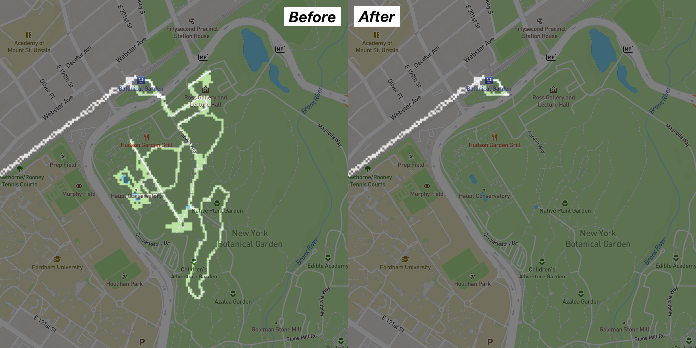

# Fog Machine

Fog Machine is a web tool for visualizing and editing the data of [_Fog of World_](https://fogofworld.app/) App. Currently, it supports:

- import and visualize FoW data
- delete tracks
- export data (if you delete any tracks, you need to reinstall your FoW App first, and then sync with modified data.)

You may use fog machine at [https://fogmachine.8bits.io/](https://fogmachine.8bits.io/)

## Examples




## Security, Privacy, and Consistency

Fog Machine is an open-source static web application. That means all your data stays in your web browser and you can audit our code to verify this.

We render and edit your data at the same resolution as the original file and we'll recompute the checksum when you export. The file exported by Fog Machine should be consistent with the file handled by FoW App.

## Why original FoW App does not support deleting tracks?

By reverse engineering, we found the sync data of FoW 2 contains no version info. Whenever App syncs, it takes a union of cloud data and the local data -- in other words, you can only **add** tracks to the App's internal storage through syncing.

Also because of this, if you delete any track using our tool, you need to reinitialize your FoW App (clean up its internal storage) before syncing with modified data.

# Contributing

PRs are welcomed, and in particular, we are expecting the following features:

- more language support
- adding tracks (import gpx, etc.)

To understand the internal sync format of FoW App, you may refer to [Fog-of-World-Data-Parser](https://github.com/CaviarChen/Fog-of-World-Data-Parser) project.

---

Install required dependency and run the web App:

```bash
yarn install
yarn start
```

By default, Fog Machine will be hosted at `http://localhost:3000`.

Linter support:

```bash
yarn run cicheck
yarn run autofix
```

# License

Fog Machine is available under the [MIT License](https://opensource.org/licenses/MIT).
