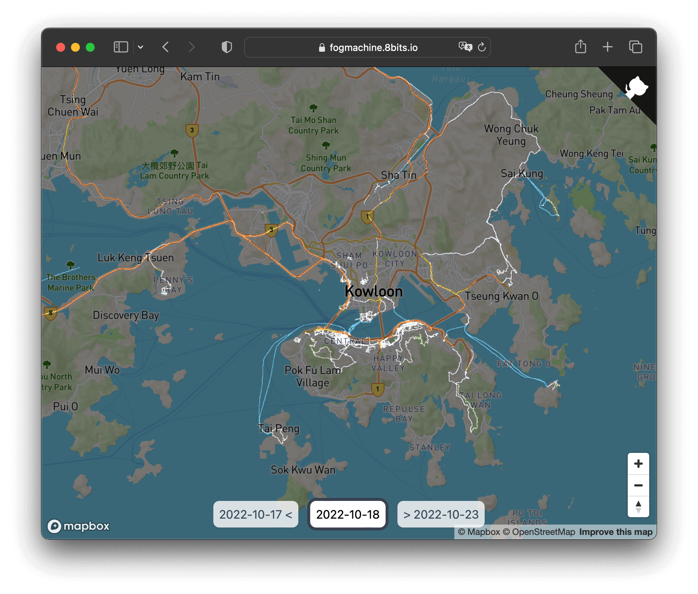

# Fog Machine

**Fog Machine** is a 3rd party extension tool for the app [Fog of World](https://fogofworld.app/en/). It contains the following components:
- Editor: A tool for visualizing and editing Fog of World data.
- Time Machine: A service for snapshotting and preserving history of Fog of World data.

[Use it directly](https://fogmachine.8bits.io/)

More background story about Fog Machine project can be found on [my blog](https://www.zijun.dev/en/tags/fog-of-world/).

---
**迷雾机器** 是 [世界迷雾APP](https://fogofworld.app/zh-hans/) 的第三方扩展工具。它包含如下组件：
- 编辑器: 世界迷雾数据的可视化编辑工具。
- 时光机: 世界迷雾数据快照及历史数据管理服务。

[直接使用](https://fogmachine.8bits.io/)

更多有关迷雾机器项目的背景故事可以在[我的博客](https://www.zijun.dev/zh/tags/fog-of-world/)上找到。

## Screenshot




## Disclaimer
As a free and open source service, it comes with no warranties, use at your own risk.
Time Machine will collect and save your Fog of World data. However Editor is fully offline and can be used without Time Machine.

## Project Setup 
Folder structure:
```c
.
├── editor   // frontend for Editor
├── frontend // frontend for everything else (home page + Time Machine)
└── server   // backend for everything (Time Machine)
```

For all parts, you need to set up environment variable correctly before running it. You could use `.env.local.example` file as an example and rename it to `.env.local`.

For frontend parts, we are using `yarn`. You can use `yarn install` to install the required dependencies and use `yarn start` to run it. You might also find `yarn run cicheck` and `yarn run autofix` useful.

For backend parts, we are using `cargo`. You can use `cargo run` to run it.

## Contributing
We ❤️ contributions from the open-source community! If you want to contribute to this project, you can look out for issues you'd like or create new issues.